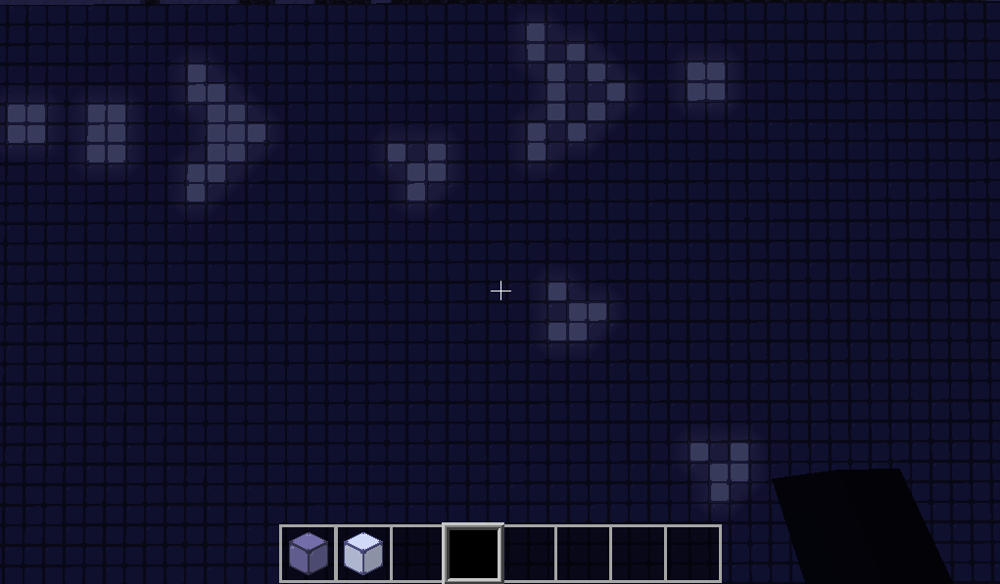

# conway_game_of_life-minetest

## how to use:
Paste this foulder in `minetest-location/mods/`

Build a grid with dead_cells and use right click to convert the dead_cell in a live_cell, use command `\lifegame true` to run simulation.

enjoy! :fox_face:
